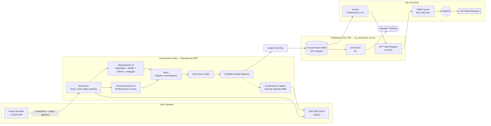
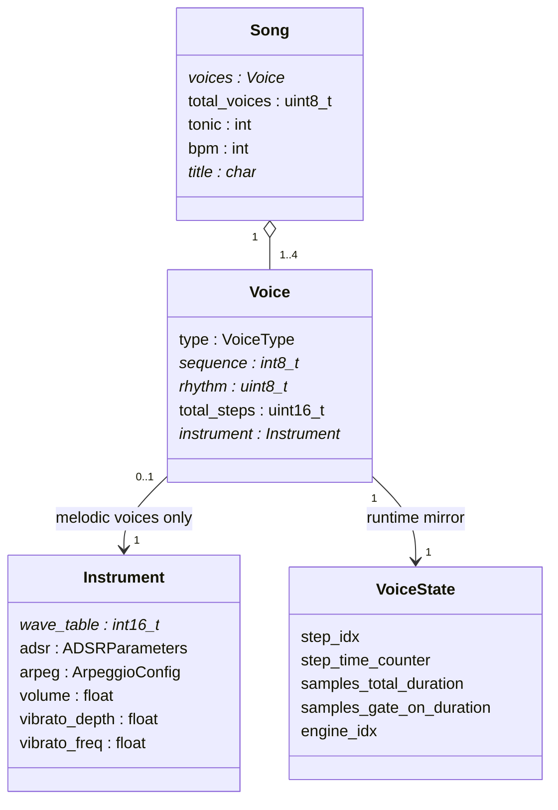
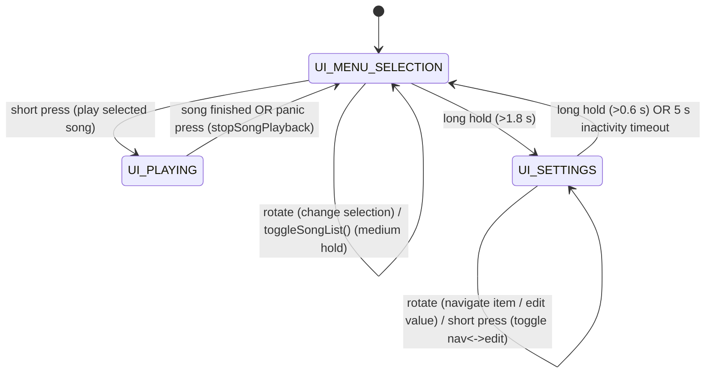

# Arduino Musical Emotions Emitter

**A 4‑voice polyphonic Arduino synthesizer, medium‑wave AM radio transmitter, and educational DSP platform that turns emotions into music — and broadcasts them through the air.**

---
> A complete design and development article is available on element14, covering the entire journey from the first Arduino RF experiments to the finished Musical Emotions Emitter:
>
> https://community.element14.com/challenges-projects/project14/b/make-a-connection/posts/musical-emotions-emitter-broadcasting-emotions-over-medium-wave-radio
---

> Select an emotion with a rotary encoder. The Arduino synthesizes a short original composition in real time — wavetables, ADSR envelopes, vibrato, arpeggios and modeled percussion — routes it to an onboard DAC/speaker, **and** simultaneously uses it to amplitude‑modulate a medium‑wave RF carrier that any nearby AM radio can receive.

```
Board        : Arduino UNO R4 Minima  (arduino:renesas_uno:minima)
MCU          : Renesas RA4M1 (Arm Cortex-M4 @ 48 MHz)
Sample rate  : 16,000 Hz (fixed)
Polyphony    : 4 melodic voices + 2 percussion voices
Outputs      : 12-bit internal DAC (monitor audio) + PWM-based AM carrier (531–1602 kHz)
Display      : 128×32 I2C OLED (SSD1306)
Input        : KY-040 rotary encoder with integrated push-button
IDE          : Arduino IDE (arduino:renesas_uno core)
```

---

## Table of Contents

- [1. Project Overview](#1-project-overview)
- [2. System Architecture and Hardware Specifications](#2-system-architecture-and-hardware-specifications)
- [3. Functional Blocks](#3-functional-blocks)
- [4. Real-Time DSP Audio Pipeline](#4-real-time-dsp-audio-pipeline)
  - [4.1 Phase Accumulation and Wavetable Generation](#41-phase-accumulation-and-wavetable-generation)
  - [4.2 ADSR Envelope](#42-adsr-envelope)
  - [4.3 Vibrato Modulation](#43-vibrato-modulation)
  - [4.4 Arpeggiator](#44-arpeggiator)
  - [4.5 Drums and Percussion Models](#45-drums-and-percussion-models)
  - [4.6 Mixer, Polyphony and Dynamic Normalization](#46-mixer-polyphony-and-dynamic-normalization)
  - [4.7 Soft-Knee Limiter](#47-soft-knee-limiter)
  - [4.8 Feedback Delay Network](#48-feedback-delay-network)
- [5. RF Transmission Subsystem](#5-rf-transmission-subsystem)
  - [5.1 PWM RF Carrier Generation and AM Modulation](#51-pwm-rf-carrier-generation-and-am-modulation)
  - [5.2 Arcsine Predistortion](#52-arcsine-predistortion)
- [6. Software Architecture](#6-software-architecture)
- [7. Rotary Encoder Gesture Logic](#7-rotary-encoder-gesture-logic)
- [8. Content Authoring Guide](#8-content-authoring-guide)
  - [8.1 How to Design a New Instrument](#81-how-to-design-a-new-instrument)
  - [8.2 How to Design a New Voice](#82-how-to-design-a-new-voice)
  - [8.3 How to Design a New Song](#83-how-to-design-a-new-song)
- [9. Telemetry and Serial Monitor Output](#9-telemetry-and-serial-monitor-output)
- [10. Oscilloscope and OLED Rendering Engine](#10-oscilloscope-and-oled-rendering-engine)
  - [10.1 Additive Multi-Scale Zoom Pipeline](#101-additive-multi-scale-zoom-pipeline)
- [11. Compilation and Development Process (Arduino IDE)](#11-compilation-and-development-process-arduino-ide)
- [12. Repository Layout](#12-repository-layout)
- [13. Regulatory Notice](#13-regulatory-notice)
- [14. Known Limitations and Future Work](#14-known-limitations-and-future-work)
- [15. License](#15-license)

---

## 1. Project Overview

The **Musical Emotions Emitter** is a self-contained embedded synthesizer built on an **Arduino UNO R4 Minima**. It was born from a simple question explored as a father‑and‑son electronics project: *what if a feeling could be turned into music and sent through the air as a radio signal?*

The firmware implements, from scratch and without any external audio library:

- A **real-time, sample-by-sample DSP synthesis engine** (wavetable oscillators, ADSR envelopes, vibrato, arpeggios, and physically‑inspired percussion models) driving up to **6 simultaneous voices**.
- A **software mixer** with adaptive gain normalization and a musical soft-knee limiter, feeding a stereo-like dual output stage.
- A **12-bit DAC output** for local monitoring through a speaker/amplifier.
- A **PWM-based medium-wave (MW) AM transmitter**, where the same audio signal that comes out of the speaker also modulates a 531–1602 kHz RF carrier, correctable via an **arcsine predistortion LUT** for linear demodulated audio.
- A **rotary-encoder-driven user interface** with a 128×32 OLED display, a song browser, a live oscilloscope/telemetry overlay, and a full Settings menu (volumes, AM frequency, output routing).
- A **library of 20 "emotion" songs** (`PLAYER[]`) — each one an intentionally composed miniature (tempo, harmony, instrumentation, and effects mapped to a specific emotional state) — plus a parallel **29-track feature-showcase demo library** (`DEMO_SONGS[]`) used to audition every DSP subsystem in isolation.

No audio file is ever stored or played back: **every note of every song is synthesized live**, sample by sample, by the code in this repository.

A companion browser-based emulator (see the project blog) reproduces the core synthesis engine for experimentation without hardware.

---

## 2. System Architecture and Hardware Specifications

### 2.1 Bill of Materials

| Component | Role | Notes |
|---|---|---|
| Arduino UNO R4 Minima | Main controller | Renesas RA4M1, Arm Cortex-M4 @ 48 MHz, hardware `FspTimer`/GPT peripherals, 12-bit DAC |
| SSD1306 OLED, 128×32, I2C | User interface / oscilloscope | Address `0x3C` (fallback `0x3D`), driven via `Adafruit_SSD1306` / `Adafruit_GFX` |
| KY-040 rotary encoder module | Navigation and parameter editing | Quadrature outputs (CLK/DT) + integrated push-button |
| Speaker / amplified monitor | Local audio monitor | Connected to `A0` (internal DAC channel) |
| Ferrite-rod / short-wire antenna | Medium-wave radiator | Connected to `D9` (PWM AM carrier) through appropriate filtering/coupling components |
| Nearby AM (MW) radio receiver | Listening device | Tuned to the configured carrier frequency (531–1602 kHz) |

### 2.2 Pin Map

| Signal | Pin | Direction | Purpose |
|---|---|---|---|
| `PIN_RFAM` | D9 | Output (PWM) | AM-modulated RF carrier |
| `PIN_MONITOR_DAC` | A0 | Output (DAC) | 12-bit analog audio monitor |
| `PIN_ENC_CLK` | D2 | Input (pull-up) | Rotary encoder channel A |
| `PIN_ENC_DT` | D3 | Input (pull-up) | Rotary encoder channel B |
| `PIN_ENC_SW` | D4 | Input (pull-up) | Rotary encoder push-button |
| OLED SDA/SCL | I2C bus | Bidirectional | SSD1306 display @ `0x3C` |

### 2.3 High-Level Block Diagram



### 2.4 Design Principle: Decoupled Synthesis and Sampling

The system is built around one deliberate architectural separation:

1. **`loop()` computes audio "in the background"**, outside of any interrupt, using the synthesis engine in `dsp.h`. Finished samples are queued into a lock-free circular buffer (`AudioBuffer`, `audio_buf`).
2. **A hardware timer ISR (`cb_audio`)** consumes that buffer at a strictly periodic rate (`SAMPLE_RATE` = 16,000 Hz) and writes each sample to both physical outputs simultaneously: the DAC and the RF PWM duty register.

This means CPU-heavy synthesis (wavetable interpolation, envelopes, delay lines, OLED rendering) never has to fit inside an interrupt and can never introduce timing jitter into the sample clock — only the ISR touches the time-critical hardware registers, and it does the absolute minimum work possible (a buffer pop and two register writes).

---

## 3. Functional Blocks

| # | Block | Source file | Description |
|---|---|---|---|
| 1 | Wave table generator | `dsp.h` / `setup()` | Precomputes 6 × 256-sample lookup tables (sine, triangle, square, saw, bright triangle, warm triangle) at boot |
| 2 | `MelodySynth` engine | `dsp.h` | Monophonic per-voice oscillator: phase accumulator, vibrato LFO, arpeggiator, low-pass smoothing, ADSR |
| 3 | `PercussionSynth` engine | `dsp.h` | Procedural drum/percussion models (kick, snare, hi-hats, crash, clap, toms) |
| 4 | `DelayEffect` | `dsp.h` | Single-tap feedback delay line with damped feedback path |
| 5 | Sequencer | `.ino` (`load_step`, `change_song`, `compute_next_dsp_sample`) | Step-based music sequencer driving up to 4 concurrent voices per song |
| 6 | Mixer & limiter | `.ino` (`compute_next_dsp_sample`, `softClip`) | Adaptive polyphonic mixing + two-stage soft-knee saturation |
| 7 | AM modulator | `.ino` (`sampleToRegisterLUT`, `configurePWMRegister`) | Converts audio samples into PWM duty values driving a GPT timer channel as the RF carrier |
| 8 | Predistortion engine | `.ino` (`initializePredistortionLUT`) | Arcsine LUT that linearizes the PWM→RF amplitude transfer function |
| 9 | UI / Menu system | `.ino` (`UIState`, `updateOLEDDisplay`, `renderMenuScreen`) | Song browser, Demo Mode toggle, Settings menu |
| 10 | Rotary encoder driver | `.ino` (`ROTARY_TRANSITION_TABLE`, `updateRotaryEncoder`) | Full quadrature state-machine decoder with debounce/guard logic |
| 11 | Oscilloscope / telemetry | `.ino` (`wave_capture_*`, `drawWaveformFrame`) | Live waveform capture and multi-zoom-level OLED rendering |
| 12 | Diagnostics logger | `.ino` (`#if ENABLE_AUDIO_LOGS`) | Optional Serial-based DSP performance/clipping/underrun reporting |
| 13 | Song/instrument library | `emotions.h`, `instruments.h`, `demo.h` | 20 emotion songs + 29 feature-demo songs + ~90 named instrument presets |

---

## 4. Real-Time DSP Audio Pipeline

All synthesis happens **per audio sample** (every 62.5 µs at 16 kHz) inside `compute_next_dsp_sample()`, which is called from `loop()` in a tight `while (audioBufferHasSpace())` loop whenever the ring buffer has room.

### 4.1 Phase Accumulation and Wavetable Generation

Each melodic voice (`MelodySynth`) uses a classic **32-bit phase accumulator**:

```cpp
_phase += (uint32_t)current_phase_step;
uint8_t index_lut      = (_phase >> 24) & 0xFF;         // integer table index (top 8 bits)
uint8_t index_lut_next = (index_lut + 1) & 0xFF;         // wraps 255 -> 0 automatically
float   frac           = (float)((_phase >> 16) & 0xFF) / 256.0f; // fractional part
```

- The phase register is a full 32-bit word; the **top 8 bits** select one of the 256 entries in the active waveform's lookup table, and the **next 8 bits** provide a fractional value used for **linear interpolation** between two adjacent samples — this greatly reduces quantization noise/aliasing versus naive table stepping.
- Per-note pitch is derived once per MIDI note number via `precalculateMidiPhases()`, which pre-computes a 32-bit phase increment for all 128 MIDI notes at boot:

  ```cpp
  MIDI_PHASE[n] = (freq(n) * 2^32) / SAMPLE_RATE;
  ```

- Six wave tables are generated once at boot (`int16_t[256]`, fixed-point ±32767): **Sine, Triangle, Square, Sawtooth, Bright Triangle** (`|x|^0.88`-shaped, sharper harmonics) and **Warm Triangle** (`|x|^1.12`-shaped, rounder/softer harmonics) — six distinct timbral colors from one shared oscillator core.
- After table lookup, a simple one-pole **low-pass smoothing filter** (`_lpf_filter += 0.3f * (raw - _lpf_filter)`) removes residual steppiness/harsh edges from the interpolated waveform before the ADSR and volume stage are applied.

### 4.2 ADSR Envelope

Implemented as an explicit state machine (`ADSREnvelopeState`: `IDLE → ATTACK → DECAY → SUSTAIN → RELEASE → IDLE`) inside the `ADSR` class:

- `trigger()` computes the **per-sample increment/decrement** for each phase directly from the millisecond parameters and the sample rate, so the envelope always resolves in real time regardless of tempo:

  ```cpp
  _att_step = 1.0f / (attack_ms  * (SAMPLE_RATE/1000.0f) + 1.0f);
  _dec_step = (1 - sustain_level) / (decay_ms * (SAMPLE_RATE/1000.0f) + 1.0f);
  _rel_step = sustain_level / (release_ms * (SAMPLE_RATE/1000.0f) + 1.0f);
  ```
- Every `trigger()` **hard-resets** the envelope level to `0.0`, even if a previous note's `RELEASE` phase had not finished. This guarantees a clean, audible attack transient on every repeated note (e.g. two identical consecutive pitches), instead of the notes bleeding into one continuous tone.
- The sequencer calls `release()` at **85 % of the step's total duration** (`samples_gate_on_duration`), leaving the remaining 15 % as note-off "tail" — a simple, universal legato/staccato gate implemented once, in the sequencer, rather than per-instrument.

### 4.3 Vibrato Modulation

Vibrato is a **secondary low-frequency phase accumulator** modulating the primary oscillator's phase increment:

```cpp
_vibrato_phase += _vibrato_phase_step;                 // LFO phase accumulator
uint8_t idx = _vibrato_phase >> 24;                     // 256-step LFO lookup
float vibrato_mod = 1.0f + (vibrato_depth * SINE_TABLE_F[idx]);
current_phase_step *= vibrato_mod;                      // scales the pitch, not the amplitude
```

- `vibrato_freq` (Hz) sets the LFO rate; `vibrato_depth` (a small fractional value, e.g. `0.002`–`0.02`) sets how strongly the pitch is modulated.
- Because it multiplies the **phase increment**, vibrato is a true pitch-modulation effect (frequency vibrato), not amplitude tremolo, and its cost is one extra table lookup and one multiply per sample — cheap enough to run on every active voice.

### 4.4 Arpeggiator

A per-voice, sample-clocked alternator between the note's fundamental and a transposed interval:

```cpp
if (++_arpeggio_counter >= _arpeggio_sub_step_duration) {
    _arpeggio_counter = 0;
    _arpeggio_alt = !_arpeggio_alt;
}
if (_arpeggio_alt) current_phase_step *= _arpeggio_ratio;   // 2^(semitones/12)
```

- `ArpeggioConfig{ active, semitones, speed }` defines the transposition interval (e.g. `+4` for a major third, `+7` for a perfect fifth, `+12` for an octave) and the alternation speed.
- The sub-step duration is derived once, at instrument-cache time, from a fixed 1/8-note reference window (`SCALE_SAMPLES(125) / speed`), so `speed` behaves as a musically intuitive "how many alternations per eighth-note" knob rather than a raw sample count.
- Multiple demo songs (`4.1`–`4.3` in `demo.h`) isolate this feature at increasing interval/speed to audition it independently.

### 4.5 Drums and Percussion Models

`PercussionSynth` synthesizes each drum voice **procedurally** — there are no percussion wavetables — using simple physically-inspired models, each driven by an **incremental exponential decay** (`env *= coeff`, where `coeff = exp(-1/(tau·SAMPLE_RATE))` is computed once per hit) instead of a per-sample `expf()` call:

| Instrument | Synthesis model |
|---|---|
| **Kick** | Sine oscillator with a fast pitch-down sweep (`60 Hz + 120 Hz·env`) and a short amplitude decay (`τ ≈ 80 ms`) |
| **Snare** | White noise (LFSR generator) blended 70/30 with a short tonal "body" sine burst |
| **Hi-hat (closed/open)** | White noise with a very short (`τ ≈ 20 ms`) or longer (`τ ≈ 150 ms`) decay |
| **Crash** | White noise with a long decay (`τ ≈ 400 ms`) for a wide, sustained metallic wash |
| **Clap** | Multiple staggered noise bursts using a piecewise, modulo-gated decay envelope to emulate the characteristic multi-hit "flam" of a hand clap |
| **Toms (low/mid/high)** | Sine oscillator with a pitch-down sweep around a per-tom base frequency (90/130/180 Hz) |

The pseudo-random noise source is a **16-bit Galois LFSR** (`0xB400` tap mask), reseeded implicitly by continuous shifting; it is shared by every noise-based percussion voice. Each `PercussionSynth` instance keeps **its own** phase/decay state (an explicit bugfix versus an earlier revision that used `static` locals shared across instances, which caused audible clicks/pops from stale phase on retrigger). Percussion voices are entirely self-terminating (`_step > SCALE_SAMPLES(8000)` forces `PercussionType::NONE`), so the sequencer never needs to track a percussion "note off."

### 4.6 Mixer, Polyphony and Dynamic Normalization

`compute_next_dsp_sample()` is the central per-sample mixer:

1. Every active voice (up to `MAX_MELODIC_VOICES` = 4 melodic + `MAX_PERCUSSION_VOICES` = 2 percussion) is advanced by one sample and summed into two separate accumulators: `melodic_accum` and `percussion_accum`.
2. Each bus is independently scaled by a user-controllable relative-balance gain (`g_melodic_level`, `g_percussion_level`), set from the Settings menu.
3. The combined signal is then **adaptively normalized** by the count of currently *sounding* voices (not merely configured voices — an idle/finished ADSR does not count), using a fixed equal-power table:

   ```cpp
   ACTIVE_VOICE_NORMALIZATION[] = { 0, 1.0, 0.7071, 0.5774, 0.5000 }; // 1/sqrt(N), N=0..4+
   ```

   This keeps overall loudness roughly constant whether one voice or all six are sounding, instead of either clipping hard with many voices or sounding quiet with just one.

### 4.7 Soft-Knee Limiter

Implemented in `softClip()` and applied **twice** in the signal chain (once on the raw mix, once on the post-delay signal) plus a final pass after the master volume stage:

```cpp
inline float softClip(float x) {
    const float knee = 0.7f;
    if (x >  knee) return  knee + (1.0f - knee) * tanhf(( x - knee) / (1.0f - knee));
    if (x < -knee) return -knee - (1.0f - knee) * tanhf((-x - knee) / (1.0f - knee));
    return x; // linear, bit-exact pass-through below the knee
}
```

Below `±0.7` the signal is untouched (linear region, zero coloration); above that threshold it is gently saturated with a `tanh()` curve instead of being hard-clipped. This avoids the sharp odd-harmonic distortion of a naive `constrain(x, -1, 1)`, which previously caused audible "grit"/"crunch" whenever several voices, delay feedback, and the master gain summed above full scale simultaneously.

### 4.8 Feedback Delay Network

`DelayEffect` is a single-tap echo/delay line with a **damped feedback path**:

```cpp
_feedback_prev = 0.7f * _feedback_prev + 0.3f * delayed_sample;      // 1-pole LPF in the feedback loop
buffer_input   = constrain(input + _feedback_prev * FEEDBACK, -1, 1); // FEEDBACK = 0.45
output         = input + delayed_sample * 0.70f;                     // dry + wet mix
```

- Buffer length is `DELAY_BUFFER_SIZE = SCALE_SAMPLES(256)` samples — at the fixed 16 kHz sample rate this is **512 samples ≈ 32 ms** of delay time.
- The low-pass filter inside the feedback path progressively darkens each successive repeat, mimicking the high-frequency air/tape losses of an analog echo rather than producing a harsh, fully-repeating digital echo.
- `SCALE_SAMPLES()`/`SCALE_PHASE_STEP()` macros exist throughout the codebase specifically so that buffer sizes and hard-coded timing constants remain correct if `SAMPLE_RATE` is ever changed from its current fixed 16,000 Hz value.

---

## 5. RF Transmission Subsystem

### 5.1 PWM RF Carrier Generation and AM Modulation

The RF carrier is generated by one of the RA4M1's **GPT (General PWM Timer) peripherals**, configured through the `analogWave`/`PwmOut` (`pwm.h`) abstraction at a nominal carrier frequency of **594 kHz by default**, adjustable in the Settings menu across the full **medium-wave broadcast band, 531–1602 kHz**, in 9 kHz steps (the ITU Region 1 MW channel spacing).

AM modulation is achieved by **modulating the PWM duty cycle** of that carrier in real time, sample by sample:

```cpp
DUTY_MIN_PERC = 5.0f;    DUTY_MAX_PERC = 45.0f;
DUTY_CENTER_PERC     = 25.0f;   // (5+45)/2
DUTY_HALF_RANGE_PERC = 20.0f;   // (45-5)/2
```

At startup, `configurePWMRegister()` locates the correct GPT register block for the pin the timer is bound to and caches a direct pointer to its **duty-cycle compare register** (`GTCCR[0]` or `GTCCR[1]`, selected by inspecting `GTIOR_b.OAE`) into `g_duty_reg`. This lets the audio ISR write a new duty value **directly to the peripheral register on every sample**, with none of the overhead of a normal `analogWrite()`/library call — a requirement at 16,000 duty updates per second.

Because a PWM square wave's *fundamental* Fourier component amplitude is proportional to `sin(π·duty)`, not to `duty` itself, driving the duty cycle linearly with the audio sample would introduce audible non-linear distortion in the demodulated AM envelope. This is corrected by the predistortion stage below.

### 5.2 Arcsine Predistortion

`sampleToRegister()` computes the *exact* nonlinear inverse needed to linearize the fundamental-harmonic amplitude of a duty-modulated PWM carrier:

```cpp
target_sin  = SIN_CENTER + sample * SIN_HALF_RANGE;   // desired linear amplitude, expressed as sin(pi*duty)
duty_frac   = asinf(target_sin) / PI_F;               // predistorted duty fraction
counts_f    = period_counts * duty_frac;              // convert to hardware timer counts
```

where `SIN_MIN = sin(π·0.05)`, `SIN_MAX = sin(π·0.45)`, and `SIN_CENTER`/`SIN_HALF_RANGE` are their midpoint/half-span, precomputed once in `initializePredistortion()`.

Since a hot `asinf()` call on every one of 16,000 samples/second would be prohibitively expensive on a Cortex-M4 running everything else in real time, the exact transfer function above is instead **pre-baked once into a 513-entry lookup table** (`lut_asin_duty[513]`, power-of-two-plus-one resolution) by `initializePredistortionLUT()`. During real-time playback, `sampleToRegisterLUT()` performs only an index computation and a table read — no trigonometry in the hot path:

```cpp
idx = round((sample + 1.0f) * 0.5f * (LUT_ASIN_SIZE - 1));
return lut_asin_duty[idx];   // no interpolation: 513 points are dense enough
```

Whenever the AM carrier frequency is changed at runtime (`setAMFrequencyKHz()`), the PWM period changes, which means the number of hardware timer counts per duty percentage changes too — so the predistortion LUT is **rebuilt from scratch** immediately after reconfiguring the PWM peripheral, keeping the linearization valid for the new period.

---

## 6. Software Architecture

### 6.1 File Structure

| File | Responsibility |
|---|---|
| `musical_emotions_emitter_v19.ino` | Hardware bring-up, ISR, mixer, UI state machine, encoder/button gesture logic, OLED rendering, Settings menu, diagnostics |
| `synth_types.h` | Core data types: `Instrument`, `Voice`, `Song`, `ADSRParameters`, `ArpeggioConfig`, runtime state structs (`VoiceState`, `SequencerState`, `AudioBuffer`), global sizing constants |
| `dsp.h` | The synthesis engine itself: `ADSR`, `MelodySynth`, `PercussionSynth`, `DelayEffect` classes, and the six global wavetables |
| `instruments.h` | ~90 named, reusable `Instrument` presets shared across songs (e.g. `INST_BELL`, `INST_TRUMPET_LEAD`, `INST_BASS_SUB`) |
| `emotions.h` | The 20-song emotional playlist (`PLAYER[]`): melodies, rhythms, per-song instrument tweaks, `Song` definitions |
| `demo.h` | The 29-song feature-showcase playlist (`DEMO_SONGS[]`), grouped into 10 numbered categories that each isolate one DSP subsystem |
| `sketch.json` | Arduino IDE/CLI board metadata (FQBN: `arduino:renesas_uno:minima`) |

### 6.2 Core Data Model



A `Song` is a `const`, flash-resident, fully-static description of a composition: an array of `Voice`s (each a melodic or percussion track), a shared `tonic` MIDI note and `bpm`. **Nothing about a song is ever mutated at runtime** — all mutable playback state lives in the parallel `SequencerState`/`VoiceState` structures, so a `Song` can be safely re-played, or swapped mid-playback, without needing to be reset or copied.

### 6.3 UI State Machine



- **`UI_MENU_SELECTION`** — browsing a song list. "Demo Mode" is *not* a distinct state: `g_current_song_list`/`g_current_song_count` are simply repointed between `PLAYER[]` and `DEMO_SONGS[]` by `toggleSongList()`, and every downstream function (selection, playback, rendering) is agnostic to which list is active.
- **`UI_PLAYING`** — the sequencer is actively driving `compute_next_dsp_sample()`. The rotary encoder is repurposed here to control oscilloscope zoom (see [§10.1](#101-additive-multi-scale-zoom-pipeline)), and the push-button becomes an instant "panic" stop.
- **`UI_SETTINGS`** — a small parameter editor (5 items: melody/percussion/master volume, AM frequency, output routing) with its own navigate/edit sub-mode and an inactivity auto-exit timer (5 s).

### 6.4 Main Loop Cooperative Scheduling

`loop()` runs one of three mutually-exclusive branches depending on `current_ui_state`:

- While **playing**, it greedily fills the audio ring buffer (`while (audioBufferHasSpace())`), and — every 8th generated sample — makes a bounded check of the panic button and the playback-mode rotary encoder, so input latency stays low without ever letting UI polling interrupt time-critical synthesis. OLED drawing during playback is deliberately deferred until the ring buffer is completely full (the ISR then has maximum lead time to keep draining uninterrupted while the loop blocks on a slow I²C `display.display()` call).
- While **browsing the menu** or **in Settings**, it simply polls the encoder/button and refreshes the display on state changes — there is no time-critical work to protect in these states.

---

## 7. Rotary Encoder Gesture Logic

### 7.1 Quadrature Decoding

Rotation is decoded with a **full quadrature state machine** (the classic "Ben Buxton" full-step table), not a naive single-edge-plus-time-window debounce:

```
State table indexed by [current_state][pin_state], pin_state = (DT<<1 | CLK)
```

A single-edge debounce would let a mechanical bounce that partially turns and springs back register as a spurious step (the "jumps back to the previous menu item" bug). The full-step table only emits a `CW`/`CCW` event once the encoder has walked through a **complete, valid sequence of quadrature states and landed back on a detent** (`ROT_R_START`); a bounce that reverses mid-travel simply retraces the same table path and produces no output at all.

### 7.2 Button/Rotation Cross-Talk Suppression

KY-040 modules share a single mechanical shaft/bushing between the rotation contacts and the push-switch, so pressing the button can mechanically jolt the CLK/DT lines enough to be misread as a rotation step. The firmware suppresses rotation decoding:

- **while the button is physically held down**, and
- for a short **guard window** (`ENCODER_BUTTON_ROTARY_GUARD_MS` = 150 ms) after *any* debounced press/release edge.

During suppression, the quadrature state machine is force-reset to its idle detent (`ROT_R_START`) so that noise picked up while suppressed cannot leave the decoder mid-transition and fire a stale event the instant suppression lifts.

### 7.3 Button Gestures

| Gesture | Context | Action |
|---|---|---|
| Short press (< 600 ms) | `UI_MENU_SELECTION` | `startSongPlayback()` — play the highlighted song |
| Short press | `UI_SETTINGS` | Toggle between *browsing items* and *editing the selected item's value* |
| Short press | `UI_PLAYING` | Instant panic stop (`stopSongPlayback()`) — a single new press, debounced and latched so it fires exactly once per hold |
| Medium hold (≥ 600 ms, < 1.8 s), released in `UI_MENU_SELECTION` | Menu | `toggleSongList()` — switches between the emotion playlist and the Demo Mode playlist |
| Long hold (≥ 1.8 s), fires live while held, from `UI_MENU_SELECTION` | Menu | Enters `UI_SETTINGS` |
| Long hold (≥ 600 ms), fires live while held, from `UI_SETTINGS` | Settings | Exits back to `UI_MENU_SELECTION` |
| Rotate CW/CCW | `UI_MENU_SELECTION` | Next/previous song in the active list (wraps) |
| Rotate CW/CCW | `UI_SETTINGS`, browsing | Next/previous settings item (wraps) |
| Rotate CW/CCW | `UI_SETTINGS`, editing | Increment/decrement the selected value by one encoder step |
| Rotate CW/CCW | `UI_PLAYING` | Zoom the live oscilloscope in/out (see §10.1) — does **not** affect song selection |

Two long-press *tiers* deliberately share one physical button:

- `SETTINGS_PRESS_MS` (1800 ms, the **longer** hold) is resolved **live**, the instant the threshold is crossed, because Settings must be enterable even from a single sustained hold.
- `LONG_PRESS_MS` (600 ms, the **shorter** hold) can only be resolved **on release**, because at the 600 ms mark the firmware cannot yet know whether the user intends to keep holding past 1800 ms. If the total hold time lands in `[600 ms, 1800 ms)` and Settings did not already fire live, `toggleSongList()` runs on release.

---

## 8. Content Authoring Guide

Because every song and instrument is a plain `const` C++ struct, extending the library requires no build tooling beyond the Arduino IDE itself.

### 8.1 How to Design a New Instrument

An `Instrument` in `synth_types.h` bundles everything needed to describe a melodic timbre:

```cpp
struct Instrument {
    const int16_t* wave_table;   // one of the 6 global tables (or a new one you add)
    ADSRParameters adsr;         // { attack_ms, decay_ms, sustain_level, release_ms }
    ArpeggioConfig arpeg;        // { active, semitones, speed }
    float volume;                // 0.0 - 1.0, relative output level
    float vibrato_depth;         // typically 0.0 - 0.02
    float vibrato_freq;          // Hz, typically 1 - 9 Hz
};
```

Recipe:

1. **Pick a wave table** for the desired base timbre: `SINE_TABLE` (pure/soft), `TRIANGLE_TABLE` (mellow), `WARM_TRIANGLE_TABLE` (rounder), `BRIGHT_TRIANGLE_TABLE` (edgier), `SQUARE_TABLE` (hollow/chiptune), `SAW_TABLE` (buzzy/brass-like).
2. **Shape the envelope** with `ADSRParameters`. Fast attack (1–15 ms) + short decay reads as *plucked/percussive*; slow attack (100–800 ms) reads as a *pad/swell*. `sustain_level` near `0` produces naturally decaying (piano/bell-like) notes even with a long `release_ms`.
3. **Decide on vibrato.** `0.0f` for both fields disables it entirely (recommended for basses/percussive plucks). For expressive leads, start around `vibrato_depth = 0.003–0.01`, `vibrato_freq = 4–7 Hz`.
4. **Decide on the arpeggiator.** Leave `{ false, 0, 0 }` for a normal sustained/plucked note. Enable it (`{ true, semitones, speed }`) for a "busy"/rhythmic texture — common choices are `4` (major third), `7` (perfect fifth) or `12` (octave) semitones.
5. **Set `volume`** relative to the other instruments the new one will play alongside — remember the mixer already normalizes for the *number* of active voices, so this is a *timbral balance* knob, not an overall loudness knob.
6. Declare it as a `const Instrument` at file scope (in `instruments.h`, or locally above the song that uses it), following the existing `INST_<ROLE>_<VARIANT>` naming convention.

```cpp
const Instrument INST_MY_LEAD = {
    BRIGHT_TRIANGLE_TABLE,   // wave_table
    { 8, 140, 0.55f, 220 },  // adsr: attack, decay, sustain, release
    { false, 0, 0 },         // arpeg: off
    0.80f,                   // volume
    0.006f,                  // vibrato_depth
    5.0f                     // vibrato_freq (Hz)
};
```

> **Adding a brand-new waveform:** declare an extra `int16_t YOUR_TABLE[256]` global next to the existing tables in `dsp.h`, fill it in the wavetable-generation loop in `setup()` (see the existing bright/warm-triangle shaping via `powf(fabsf(x), exponent)` as a template), and reference it from any `Instrument`.

### 8.2 How to Design a New Voice

A `Voice` (in `synth_types.h`) is one sequenced track — either melodic or percussion:

```cpp
struct Voice {
    const VoiceType type;             // VoiceType::MELODY or VoiceType::PERCUSSION
    const int8_t* const sequence;     // semitone offsets from the song tonic (melody) or PercussionType values
    const uint8_t* const rhythm;      // step durations: 4=quarter, 8=eighth, 16=sixteenth, 2=half, 1=whole...
    const uint16_t total_steps;       // length of sequence[]/rhythm[]
    const Instrument* const instrument; // pointer to an Instrument (nullptr for PERCUSSION)
};
```

**Melodic voice recipe:**

```cpp
static const int8_t  melody_my_line[] = { 0, 4, 7, 12, 7, 4, 0 };  // relative semitones to tonic
static const uint8_t rhythm_my_line[] = { 8, 8, 8, 8, 8, 8, 16 };  // matching durations
// ... a Voice entry:
{ VoiceType::MELODY, melody_my_line, rhythm_my_line,
  sizeof(melody_my_line)/sizeof(melody_my_line[0]), &INST_MY_LEAD }
```

`sequence[]` values are **signed semitone offsets relative to the song's `tonic`** (e.g. `0` = tonic, `4` = major third above, `7` = perfect fifth, `-12` = one octave below), not absolute MIDI numbers — this lets the same melodic shape be transposed simply by changing the song's `tonic`.

**Percussion voice recipe:**

```cpp
static const int8_t  perc_my_beat[]   = { (int8_t)PercussionType::KICK, (int8_t)PercussionType::SNARE,
                                            (int8_t)PercussionType::KICK, (int8_t)PercussionType::SNARE };
static const uint8_t rhythm_my_beat[] = { 4, 4, 4, 4 };
// ... a Voice entry:
{ VoiceType::PERCUSSION, perc_my_beat, rhythm_my_beat, 4, nullptr }
```

Available `PercussionType` values: `KICK`, `SNARE`, `HIHAT_CLOSED`, `HIHAT_OPEN`, `CRASH`, `CLAP`, `TOM_LOW`, `TOM_MID`, `TOM_HIGH` (and `NONE` for an explicit rest step).

> `sequence[]` and `rhythm[]` **must have the same length**, given as `total_steps`. A voice loops back to `step_idx = 0` automatically once it runs past its own last step — so voices of different lengths can safely be layered together (polyrhythms/polymeter) and the shorter one will simply repeat while the longer one continues.

### 8.3 How to Design a New Song

A `Song` (in `synth_types.h`) ties 1–4 `Voice`s together with a shared key and tempo:

```cpp
struct Song {
    const Voice* const voices;
    const uint8_t total_voices;
    const int tonic;    // MIDI note number acting as the song's root (60 = middle C / C4)
    const int bpm;      // tempo
    const char* title;  // shown on the OLED (auto-truncated to fit one line)
};
```

Step-by-step:

1. Write one or more melody/rhythm/instrument sets and/or a percussion pattern, as in [§8.2](#82-how-to-design-a-new-voice).
2. Group them into a `static const Voice voices_my_song[] = { ... };` array (up to `MAX_VOICES` = 4 entries; melodic entries are capped at `MAX_MELODIC_VOICES` = 4 and percussion entries at `MAX_PERCUSSION_VOICES` = 2 — any excess voices of a given type are silently dropped by `change_song()` rather than corrupting the engine pools).
3. Define the `Song`:

   ```cpp
   const Song song_my_emotion = {
       voices_my_song,
       sizeof(voices_my_song) / sizeof(voices_my_song[0]),
       60,   // tonic: C4
       120,  // bpm
       "MY EMOTION"
   };
   ```

4. **Register it in a playlist.** Add it to the `PLAYER[]` array at the bottom of `emotions.h` (for the main emotion library) — `TOTAL_SONGS` recomputes itself automatically via `sizeof(PLAYER)/sizeof(PLAYER[0])`. To add a feature-demo track instead, append it to `DEMO_SONGS[]` in `demo.h` in the same way.

Song duration is **not** specified directly — it falls out of `calculateSongDurationSamples()`, which sums each voice's `rhythm[]` durations at the chosen `bpm` and takes the **longest** voice as the whole song's length, so a short percussion pattern can safely underlie a longer melodic line without cutting it off early.

**Composition tips baked into the existing 20-song emotion library** (see the header comment above every song in `emotions.h` for a worked example): map faster tempo + brighter waveforms + shorter envelopes to high-arousal/positive emotions (joy, celebration, confidence); map slower tempo + minor intervals + longer, softer envelopes + heavier vibrato to low-arousal/negative or reflective emotions (melancholy, resignation, dread); reserve the arpeggiator and denser harmony stacks for "energetic" states, and near-silence/very sparse voicing for states like `SILENCE` or `TEDIUM`.

---

## 9. Telemetry and Serial Monitor Output

All diagnostics are compiled **only** when `ENABLE_AUDIO_LOGS` is set to `1` at the top of the `.ino` file (default: `0`, to save SRAM/flash and avoid any runtime overhead on constrained hardware):

```cpp
#define ENABLE_AUDIO_LOGS 0   // set to 1 to enable Serial diagnostics
```

With logging enabled and `Serial.begin(115200)` active, the firmware accumulates, for the duration of one song:

- **DSP performance**: per-call timing of `compute_next_dsp_sample()` (count, sum, worst-case microseconds) via `printDspPerformanceReport()`.
- **Clipping events**: every time the mix, the post-delay signal, or the final output sample exceeds `±1.0`, tagged with a `ClippingReason` (`MIX_OVERLOAD`, `DELAY_OVERLOAD`, `OUTPUT_OVERLOAD`) and logged (capped at 24 entries) via `printClippingLog()`.
- **Discontinuity ("click") detection**: any inter-sample jump larger than `CLICK_DELTA_THRESHOLD` (0.25) is logged (capped at 32 entries) with the previous/current values and the delta, via `printAudioArtifactReport()`.
- **Ring-buffer health**: underrun event count, longest underrun streak, and min/max/average buffer occupancy — useful for confirming the audio pipeline has enough headroom versus the OLED's blocking I²C transfer time (see the design note in the source directly above `g_active_song`).

Typical Serial Monitor output at the end of a song (illustrative):

```
========================================
        AUDIO ARTIFACT REPORT
========================================
Clicks/discontinuities: 0
Audio underrun samples: 0
Audio underrun events: 0
Longest underrun: 0
Minimum buffer level: 240
Maximum buffer level: 511
Average buffer level: 402.17
========================================
```

Because this instrumentation is fully compiled out when disabled, it is safe to leave the hooks (`recordClippingEvent`, `updateAudioBufferDiagnostics`, etc.) scattered through `compute_next_dsp_sample()` without any impact on production performance.

---

## 10. Oscilloscope and OLED Rendering Engine

The 128×32 OLED does triple duty: song browser, live playback dashboard, and a small real-time oscilloscope.

### Waveform capture pipeline

Capture happens **in `loop()`, at sample-push time — never inside `cb_audio()`**. Every generated sample updates a running **min/max** over the current display interval (not just the last sample seen), so short transient peaks are never accidentally skipped by an unluckily-timed single-sample capture:

```cpp
if (q < wave_capture_interval_min) wave_capture_interval_min = q;
if (q > wave_capture_interval_max) wave_capture_interval_max = q;
if (++wave_capture_counter >= wave_capture_stride) {
    // commit interval min/mid/max into the 128-point display buffer
}
```

Three parallel `int8_t[128]` buffers are kept — `wave_capture_buf` (interval midpoint, used for the connecting waveform line), `wave_capture_min_buf`/`wave_capture_max_buf` (interval extremes, drawn as a thin vertical "envelope" bar at each column) — giving a display that looks like a proper analog-scope trace even though it is built from decimated digital samples.

Alongside the waveform, the engine derives lightweight metrics **only at capture time** (never inside the ISR, negligible added DSP load): running **peak** level, **RMS** (root-mean-square, for a loudness bar), and a **zero-crossing count**, which is converted into an approximate dominant-frequency readout (`freq_hz`) for the compact playback status line (`P<peak%> R<rms%> V<active voices> <freq>`).

### Display is never free-running

OLED redraws over I²C (which can block for 8–14 ms) are deliberately **not** triggered on every sample. They only fire either (a) throttled to a fixed `GRAPH_UPDATE_INTERVAL_MS` (40 ms, ≈25 FPS) refresh interval, and (b) specifically in the moment the sample-generation `while()` loop in `loop()` stalls because the ring buffer is momentarily full — i.e. exactly when the ISR has the maximum possible lead time to keep draining samples uninterrupted while the main loop is blocked doing I²C. This means the oscilloscope's visual refresh rate can never turn into an audio-glitching I²C hog, even on a very short/fast song.

Frames are additionally drawn with **differential erase** where practical (only the polylines are re-drawn each frame, not a full `clearDisplay()`), minimizing the bytes actually pushed over I²C per refresh.

### 10.1 Additive Multi-Scale Zoom Pipeline

During `UI_PLAYING`, rotating the encoder does **not** change songs — it drives a **signed zoom level** (`scope_zoom_level`, range `[-9, +9]`, `0` = normal inline view) that rescales the oscilloscope's time base:

| Zoom level | Behavior |
|---|---|
| `0` | Normal, compact "now playing" screen with an inline mini-scope embedded alongside song info |
| `±1` (first detent, either direction) | Switches to **fullscreen** oscilloscope mode, at the *same* time base as the normal view — no scaling applied yet |
| `> +1` (further CW clicks) | **Zoom out**: capture stride grows *additively* by `SCOPE_ZOOM_STEP_SAMPLES` (5 samples/point) per further detent — `5, 10, 15, … 45` samples/point at the extreme (`+9`) |
| `< -1` (further CCW clicks) | **Zoom in**: capture stride shrinks by the same additive step, clamped at a hard floor of `1` sample/point (finest possible resolution, one raw sample per display column) |

This is deliberately an **additive**, not multiplicative, step scheme. An earlier revision doubled the stride per detent, which saturated the 16-bit stride variable within a handful of clicks and then did nothing for the rest of the zoom range; the additive scheme keeps every detent meaningfully different, all the way to `±9`, while the highest zoom-out level (`128 points × 45 samples/point / 16 kHz ≈ 360 ms` to fill one frame) still repaints comfortably inside one second, so the display never appears to "freeze."

Changing the zoom level (`adjustPlaybackScopeZoom()`) performs **no OLED I²C transaction itself** — it only updates the target stride and resets the capture accumulators (`resetScopeCaptureFrame()`); the actual redraw is deferred to the same safe, buffer-full window described above, keeping every gesture instantaneous from the user's perspective without ever touching the audio path.

At the fullscreen zoom levels, `drawFullscreenWaveformFrame()` additionally renders a **vertical RMS/peak power meter** alongside the waveform (using the four rightmost display columns), turning the fullscreen mode into a proper level meter + scope combination rather than just an enlarged trace.

---

## 11. Compilation and Development Process (Arduino IDE)

### 11.1 Prerequisites

1. **Arduino IDE** (2.x recommended) with the **Arduino UNO R4 board package** (`arduino:renesas_uno`) installed via *Tools → Board → Boards Manager*.
2. **Libraries** (install via *Sketch → Include Library → Manage Libraries*, or the Library Manager search box):
   - `Adafruit GFX Library`
   - `Adafruit SSD1306`
   - `FspTimer` and `analogWave` / `pwm.h` — provided as part of the Arduino UNO R4 (`renesas_uno`) core; no separate installation is normally required once the correct board package is selected.

### 11.2 Board Configuration

| Setting | Value |
|---|---|
| Board | **Arduino UNO R4 Minima** |
| FQBN | `arduino:renesas_uno:minima` |
| Port | select the serial port the board enumerates as |
| Upload speed / other | leave at IDE defaults |

(These match `sketch.json`, which is read automatically by the Arduino IDE/CLI to pre-select the correct board profile for this sketch.)

### 11.3 Building and Flashing

1. Clone or download this repository, keeping **all files in one sketch folder** whose name matches the `.ino` file (`musical_emotions_emitter_v19/`), since the Arduino build system requires the primary `.ino` file to share its parent folder's name.
2. Open `musical_emotions_emitter_v19.ino` in the Arduino IDE — the companion headers (`synth_types.h`, `dsp.h`, `instruments.h`, `emotions.h`, `demo.h`) will appear as additional tabs automatically.
3. Select the board/FQBN as above and the correct serial port.
4. Click **Verify/Compile** (checkmark icon) to build without flashing, or **Upload** (arrow icon) to compile and flash directly.
5. Wire the hardware as described in [§2](#2-system-architecture-and-hardware-specifications) *before* powering on: OLED on I2C, encoder on D2/D3/D4, speaker/monitor on A0, antenna/coupling network on D9.
6. Optional: set `ENABLE_AUDIO_LOGS 1` and open the **Serial Monitor** at `115200` baud to observe the diagnostics described in [§9](#9-telemetry-and-serial-monitor-output).

### 11.4 Command-Line Alternative (`arduino-cli`)

```bash
arduino-cli core install arduino:renesas_uno
arduino-cli compile --fqbn arduino:renesas_uno:minima ./musical_emotions_emitter_v19
arduino-cli upload  -p <PORT> --fqbn arduino:renesas_uno:minima ./musical_emotions_emitter_v19
```

### 11.5 Iterating on Content vs. Iterating on the Engine

- **Adding songs/instruments** (§8) only touches `emotions.h`, `demo.h`, and/or `instruments.h` — no changes to `dsp.h` or the `.ino` file's DSP/UI logic are needed, and a full re-compile/re-flash is quick since these are small, header-only additions.
- **Changing DSP behavior** (new effect, new oscillator shape, new percussion model) touches `dsp.h` and possibly `synth_types.h` (if new per-voice/per-instrument state is required).
- **Changing UI/hardware behavior** (new Settings item, different encoder gesture, different display layout) is confined to the `.ino` file.

---

## 12. Repository Layout

```
.
├── musical_emotions_emitter_v19.ino   # Hardware, ISR, mixer, UI/encoder logic, OLED rendering
├── synth_types.h                       # Core structs: Instrument, Voice, Song, runtime state
├── dsp.h                               # ADSR, MelodySynth, PercussionSynth, DelayEffect, wavetables
├── instruments.h                       # ~90 reusable named Instrument presets
├── emotions.h                          # PLAYER[] — 20-song emotional composition library
├── demo.h                              # DEMO_SONGS[] — 29-song feature-showcase library (10 categories)
└── sketch.json                         # Arduino IDE/CLI board metadata (FQBN)
```

---

## 13. Regulatory Notice

This project intentionally generates a radio-frequency signal in the **medium-wave (AM broadcast) band** (531–1602 kHz) and radiates it, even at very low, unintentional-emitter power levels, via a short wire or ferrite-rod antenna. Regulations governing unlicensed low-power transmission in this band (permitted field strength, antenna length, effective radiated power) **vary significantly by country/region**. Before energizing the RF output stage, check and comply with the telecommunications regulations that apply in your jurisdiction (e.g., in many regions this falls under a "Part 15"-style unlicensed/low-power exemption, but exact limits differ). This project is intended for **personal, educational, near-field experimentation** — verify your local rules before use.

---

## 14. Known Limitations and Future Work

- The oscilloscope's zero-crossing-based frequency estimate is explicitly an **approximation**: with polyphony active it reflects the apparent dominant periodicity of the summed signal, not any individual voice's exact pitch.
- Polyphony is hard-capped at compile time (`MAX_MELODIC_VOICES = 4`, `MAX_PERCUSSION_VOICES = 2`); a song configuring more voices of a given type than the pool size will have the excess voices silently dropped in `change_song()`.
- `SAMPLE_RATE` (16,000 Hz) is treated as fixed throughout the codebase; while the `SCALE_SAMPLES()`/`SCALE_PHASE_STEP()` macros exist specifically to make a rate change safer, this has not been exhaustively re-validated against every hard-coded timing constant.
- The AM tuning step (9 kHz) follows the ITU Region 1 (Europe/Africa) medium-wave channel grid; deployments intended for Region 2 (the Americas) may prefer a 10 kHz step, adjustable via the `AM_STEP_KHZ` constant.
- A browser-based emulator of the core synthesis engine exists as a companion project for experimentation without hardware (see the project's write-up) but is not part of this firmware repository.

---


